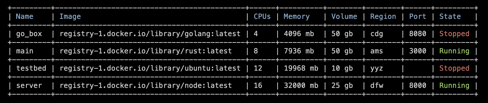

# spsd



spsd is a command line utility for managing state persistent, serverless devboxes. With spsd, you can spin up instances with 16 vCPUs, 32 gb of memory, and 500 gb of persistent disk in a region of your choice with a port open to the internet in seconds.

Instances are machines (Firecracker VMs) hosted by [fly.io](https://fly.io), launched from a docker image. You can bring your own or use one of the [base images](#images) included in spsd.

## Installation

You can install spsd via homebrew by running ```brew tap tfsingh/spsd && brew install spsd``` in your terminal. You can also install from source with ```cargo install spsd``` (must install flyctl in this case).

## Quick start

1. Navigate to [fly.io](https://fly.io), create an account (you also need to configure billing although small instances should be free), and [generate](https://fly.io/user/personal_access_tokens) an access token.

2. Configure your profile with ```flyctl auth login``` and ```spsd profile <API_KEY> <ALLOCATE_IP>```.

3. Create an instance by running ```spsd new``` and filling out the relevant fields.

4. Run the instance you just created serverlessly with ```spsd sl <NAME>```. Note that any data you'd like to be persisted should be kept on the /data path.

## Commands

### destroy

Destroy an instance

- `name` — Name of the instance

### list

List instances and associated data (name, image, cpus, memory, region, port, state)

- `ip` — List attached IPv4 addresses (optional)

### new

Create a new instance

- `name` — Name of the instance
- `image` — URL of the [image](#images)
- `cpus` — Number of vCPUs (1, 2, 4, 8, 12, 16)
- `memory` — Amount of memory (256 - 32768 MB)
- `volume` — Size of volume (1-500 GB)
- `region` — [Region](#regions) of the instance
- `port` — Port to expose (optional, 1024-65536)

Please note that Fly enforces CPU/memory ratios that may render your configuration invalid.

### profile

Set [fly.io](https://fly.io) profile

- `api_key` — Fly API key (overwrites existing)
- `allocate_ip` — Allocate a dedicated IPv4 address ($2/mo)

### sl

Run an instance serverlessly (stops instance on graceful disconnection)

- `name` — Name of the instance

### start

Start and connect to an instance

- `name` — Name of the instance

### stop

Stop an instance

- `name` — Name of the instance

## FAQ

**How do I configure my instance to respond to HTTP requests?**

First, allocate an IP to your app if you haven't already (see below). Ensure your instance has a port exposed (for example, we'll say we configured our instance to listen on port 8080), and run ```spsd list ip``` to view your dedicated IPv4 address (i.e. 123.1.23.12). Ensure your sever is listening on whatever port you exposed above in your instance configuration _locally_ (localhost:8080) and it'll be accesible publicly at the same port on your allocated ip (http://123.1.23.12:8080).

**How can I allocate an IP if I didn't initially?**

Assuming your api key is valid, run ```flyctl ip allocate-v4 -a <APP_NAME>``` in your terminal (app name is available on the fly.io [dashboard](https://fly.io/dashboard)).

## Appendix

### Regions

| Value   | City         |
| ------- | ------------ |
| ams     | Amsterdam    |
| bom     | Mumbai       |
| cdg     | Paris        |
| dfw     | Dallas       |
| fra     | Frankfurt    |
| hkg     | Hong Kong    |
| iad     | Washington DC|
| lax     | Los Angeles  |
| lhr     | London       |
| nrt     | Tokyo        |
| ord     | Chicago      |
| scl     | Santiago     |
| sea     | Seattle      |
| sin     | Singapore    |
| sjc     | San Jose     |
| syd     | Sydney       |
| yyz     | Toronto      |

### Images

The following can be entered as an image instead of providing a concrete url:
- base (ubuntu)
- python
- rust
- go
- node

## Acknowledgements

Thank you to Erik Bernhardsson for the [inspiration](https://twitter.com/bernhardsson/status/1543074570512617475) for spsd, nebula for the [code](https://github.com/nebulatgs/fade) used to parse responses from Fly's API, and the [fly.io](https://fly.io) team for building what they have.